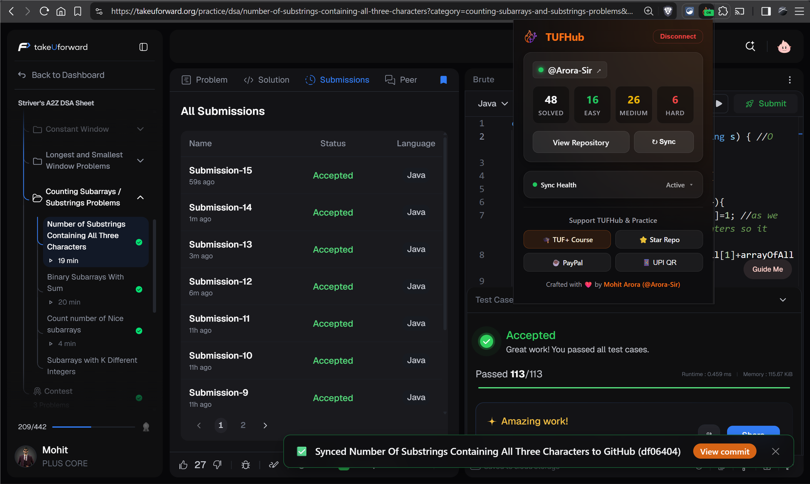
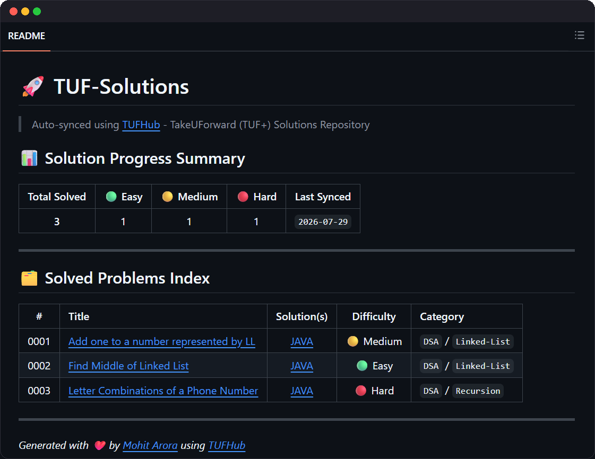
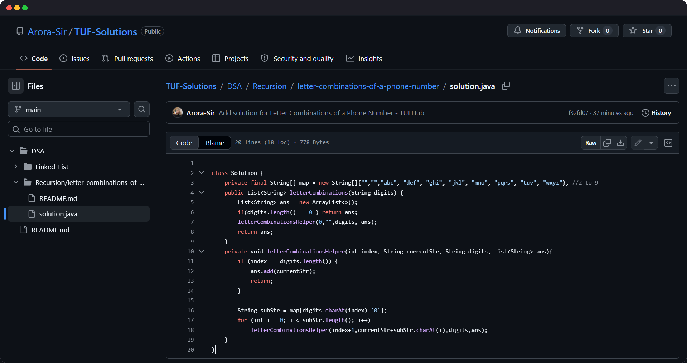

<p align="center">
  
</p>

<h1 align="center">
  TUFHub
  <br>
  <sub>Automatically sync your TakeUForward (TUF+) solutions to GitHub.</sub>
</h1>

<p align="center">
  <a href="https://github.com/Arora-Sir/TUFHub/blob/main/LICENSE">
    
  </a>
  
  
  
</p>

---

## What is TUFHub?

TUFHub is a Chrome Extension that automatically syncs your **accepted solutions** from [TakeUForward (TUF+)](https://takeuforward.org/plus?affiliate=arorasir) to a GitHub repository - the moment you get an Accepted verdict.

No manual copying. No drag and drop. Just solve, submit, and your solution lands on GitHub instantly.

---

## Screenshots & Showcase

<p align="center">
  
</p>

### 📁 Master Solutions Repository Index
Auto-maintains a structured `README.md` at the root of your solutions repository with real-time stats and topic badges.

<p align="center">
  
</p>

### ⚡ Automated Solution Commits
Commits code solutions with clean folder hierarchy, language extensions, and formatted problem statements.

<p align="center">
  
</p>

## Features

- **Auto-sync on Accept** - Intercepts the judge API response and pushes your solution only when you pass 100% test cases
- **Multi-category support** - Organizes solutions across DSA, SQL, Aptitude, and Mock Tests automatically
- **Smart folder hierarchy** - Topics and subtopics are resolved dynamically from the problem page
- **Problem README** - Generates a clean `README.md` per problem with statement, difficulty badge, and complexity analysis
- **Root index** - Maintains a master `README.md` at the root of your solutions repo with a sortable table of all solved problems
- **Stats popup** - Shows Solved / Easy / Medium / Hard counts directly in the extension popup
- **Repo scanner** - On setup or reconnect, scans your existing GitHub repository and restores stats instantly
- **Two auth methods** - Personal Access Token (fastest) or your own GitHub OAuth App
- **Conflict-safe uploads** - Uses a sequential commit chain with retry logic to avoid 409 conflicts on rapid submissions
- **Private or public** - You choose when creating your solutions repository

---

## Folder Structure

Your solutions repository will be automatically organized like this:

```
TUF-Solutions/
├── DSA/
│   ├── Arrays/
│   │   └── 0001-set-matrix-zeroes/
│   │       ├── solution.cpp
│   │       └── README.md
│   ├── Linked-List/
│   ├── Binary-Search/
│   ├── Recursion/
│   ├── Backtracking/
│   ├── Trees/
│   ├── Graphs/
│   ├── Dynamic-Programming/
│   ├── Strings/
│   ├── Stack-Queue/
│   ├── Bit-Manipulation/
│   └── Greedy/
├── SQL/
│   ├── Joins/
│   ├── Aggregation/
│   └── Subqueries/
├── Aptitude/
│   ├── Quantitative/
│   └── Logical/
├── Mock-Tests/
│   └── <Test-Slug>/
└── README.md   <-- auto-generated master index
```

---

## Installation

### Option A: Install from Source (Developer Mode)

1. Clone or download this repository:
   ```bash
   git clone https://github.com/Arora-Sir/TUFHub.git
   cd TUFHub
   ```

2. Install dependencies and build:
   ```bash
   npm install
   npm run build
   ```

3. Open Chrome and go to `chrome://extensions`

4. Enable **Developer mode** (toggle in the top-right corner)

5. Click **Load unpacked** and select the `dist/` folder

6. The TUFHub icon will appear in your Chrome toolbar

---

## Setup

After installing, TUFHub opens an onboarding page automatically. Follow the two steps:

### Step 1: Connect GitHub

Choose one of two authentication methods:

#### Personal Access Token (Recommended - Fastest)

1. Click **"Click here to generate token on GitHub"** (pre-configured link with `repo` scope)
2. Set expiration to **No expiration** (or your preferred duration)
3. Click **Generate token** and copy it
4. Paste it into the token field and click **Save Token & Continue**

#### GitHub OAuth App

> **Note:** PAT (Personal Access Token) is the recommended method for most users. OAuth is for advanced users who prefer OAuth-scoped access and are comfortable managing their own GitHub OAuth App credentials.

1. Click **Register OAuth App on GitHub** (pre-fills Application Name, Homepage URL, and Callback URL automatically)
2. Submit the form on GitHub to generate your **Client ID** and **Client Secret**
3. Enter both in TUFHub and click **Launch GitHub OAuth Flow**

### Step 2: Create Solutions Repository

1. Enter a repository name (default: `TUF-Solutions`)
2. Optionally check **Make repository private** if you want a private repo
3. Click **Create Repository & Finish Setup**

TUFHub will create the repo on your account and scan it immediately if it already has solutions.

---

## Usage

Once setup is complete:

1. Go to [TakeUForward TUF+](https://takeuforward.org/plus?affiliate=arorasir)
2. Open any problem under DSA, SQL, Aptitude, or Mock Tests
3. Write your solution and click **Submit**
4. When the verdict is **Accepted (100% test cases passed)**, TUFHub automatically:
   - Pushes `solution.<ext>` to the correct category folder
   - Creates a `README.md` with the problem statement and complexity
   - Updates the root `README.md` index table
   - Updates your stats in the popup

---

## Extension Popup

Click the TUFHub icon in your Chrome toolbar to see:

- **GitHub profile link** (your connected account)
- **Solved / Easy / Medium / Hard** counts
- **View Repository** button - opens your solutions repo on GitHub
- **Sync button (↻)** - re-scans your GitHub repository and refreshes stats on demand
- **Support section** - optional PayPal / UPI support links
- **Disconnect** button - clears all stored credentials and resets the extension

---

## Supported Languages

TUFHub detects and correctly names solution files for the following languages:

| Language | File Extension |
| :--- | :---: |
| C++ | `.cpp` |
| C | `.c` |
| Java | `.java` |
| Python / Python 3 | `.py` |
| JavaScript | `.js` |
| TypeScript | `.ts` |
| Go | `.go` |
| Rust | `.rs` |
| C# | `.cs` |
| SQL (MySQL, PostgreSQL, SQLite, Oracle) | `.sql` |

---

## Privacy & Security

- **No data leaves your machine** except to GitHub's own API (`api.github.com`) using your own personal token
- Your GitHub token is stored exclusively in your browser's local `chrome.storage.local` sandbox - it is never transmitted to any third-party server
- The OAuth Client Secret is entered by you directly and stored only in your local browser storage
- No analytics, no tracking, no telemetry of any kind

---

## Building from Source

```bash
# Install dependencies
npm install

# Production build (outputs to dist/)
npm run build

# Development build with watch mode
npm run dev
```

The build uses Webpack 5. Source files are in `src/`. The compiled extension ready for loading is in `dist/`.

---

## Project Structure

```
TUFHub/
├── src/
│   ├── manifest.json          # Chrome Extension Manifest V3
│   ├── popup.html             # Extension popup UI
│   ├── welcome.html           # Onboarding wizard page
│   ├── css/
│   │   └── popup.css          # Shared styles
│   ├── assets/
│   │   └── icons/             # Extension icons
│   └── scripts/
│       ├── popup.js           # Popup controller
│       ├── welcome.js         # Onboarding wizard logic
│       ├── background.js      # Service worker + OAuth flow
│       ├── authorize.js       # OAuth client helper
│       ├── util.js            # Shared utilities and language map
│       └── tuf/
│           ├── content.js     # Main sync engine (ISOLATED world)
│           ├── interceptor.js # Network hook (MAIN world)
│           ├── router.js      # Category and folder path resolver
│           ├── readme.js      # Problem README builder
│           ├── rootReadme.js  # Root index README builder
│           ├── stats.js       # Stats persistence and repo scanner
│           ├── uploader.js    # GitHub API commit uploader
│           ├── toast.js       # In-page notification toasts
│           └── tuf.js         # TUF+ page helpers
├── webpack.config.js
└── package.json
```

---

## FAQ

**Q: Will it sync a solution if I only pass some test cases?**
No. TUFHub only syncs when the verdict is **Accepted with 100% test cases passed**. Partial passes, wrong answers, and compile errors are ignored.

**Q: What if I submit the same problem again in a different language?**
TUFHub will add the new language file alongside the existing one in the same folder and update the root index.

**Q: My stats show 0 even though I have solutions in the repo.**
Click the **↻ Sync** button in the popup. TUFHub will scan your repository's README and Git tree to restore all stats.

**Q: Can I use an existing TUF-Solutions repository?**
Yes. During setup in Step 2, enter the name of your existing repository. TUFHub will connect to it and scan it immediately to restore your previous stats.

**Q: Is this extension affiliated with TakeUForward?**
No. This is an independent open-source project and is not affiliated with or endorsed by TakeUForward.

---

## Contributing

Pull requests are welcome. For major changes, please open an issue first to discuss what you would like to change.

---

## ⭐ Support & Community

If TUFHub helps you stay consistent on your coding journey, please consider supporting the project:

- 🎓 **Enroll in TUF+**: Get the official course via [TakeUForward (TUF+)](https://takeuforward.org/plus?affiliate=arorasir)
- ⭐ **Star this repository**: Give [TUFHub a star on GitHub](https://github.com/Arora-Sir/TUFHub)
- ☕ **Donate**: Support via [PayPal](https://paypal.me/arorasir) or UPI (`mohit1998arora@yescred`)

---

## License

[MIT](LICENSE)

---

<p align="center">
  Generated with ❤️ by <a href="https://github.com/Arora-Sir">Mohit Arora</a>
</p>
